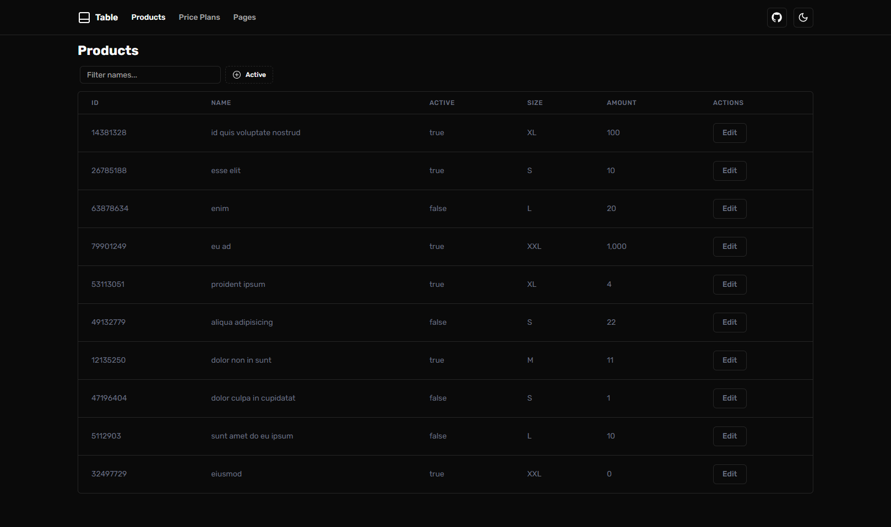

# [Systeme.io Task - Table component](https://systeme-io-task.vercel.app/)

> 🐳 DEMO: https://systeme-io-task.vercel.app/ 

Dive into the beauty of custom UI components with our NextJS Custom Table Component! This project leverages the power of NextJS, TailwindCSS, and TypeScript to deliver a sleek, scalable table component inspired by Tanstack ShadTable, without using any external libraries. Our focus is on craftsmanship and detailed custom functionality.

[](https://systeme-io-task.vercel.app/)

## 🔍 Features:

- ✅ Customizable columns (`Table` and `columns` props)
- ✅ Filtering data (via `useTable` hook)
- ✅ Dynamic debounced search filters, and faceted filters (`filterFields` prop)
- ✅ Dynamic `Table-Toolbar` with search, filters


- ⚡ [Next.js](https://nextjs.org) with App Router support
- 🔥 Type checking [TypeScript](https://www.typescriptlang.org)
- 💎 Integrate with [Tailwind CSS](https://tailwindcss.com)
- 🎨 [Shadcn/UI](https://ui.shadcn.com/) reusable components built using [Radix UI](https://www.radix-ui.com/)
- ✅ Strict Mode for TypeScript and React 18
- ⌨️ Form with [React Hook From](https://react-hook-form.com/)
- 🔴 Validation library with [Zod](https://zod.dev/)
- 📏 Linter with [ESLint](https://eslint.org)
- 💖 Code Formatter with [Prettier](https://prettier.io)
- 🦊 Husky for Git Hooks
- 🚫 Lint-staged for running linters on Git staged files
- 🚓 Lint git commit with Commitlint
- 👷 Run checks with GitHub Actions - CI
- 💡 Absolute Imports using `~` prefix
- 🐳 [Docker](https://www.docker.com/) Integration
- 🌐 Deployed on [Vercel](https://vercel.com/)
- 🌙 Light/Dark Theme support

## Running Locally

1. Clone the repository

```bash
git clone https://github.com/velenyx/systeme.io-task
```

2. Install dependencies using yarn

```bash
corepack enable
yarn set version from sources
yarn
```

3. Copy the `.env.example` to `.env` and update the variables.

```bash
cp .env.example .env
```

4. Start the development server

```bash
yarn dev
```

Open http://localhost:3000 with your favorite browser to see your project.

### Project structure

```shell
├── README.md                       # README file
├── .github                         # GitHub folder
├── .husky                          # Husky configuration
├── public                          # Public assets folder
├── src
│   ├── app                         # Next JS App (App Router)
│   ├── components                  # Components specific to project
│   ├── entities                    # Business entities
│   │   ├── api                     # API calls for entities
│   │   ├── types                   # TypeScript types
│   ├── shared                      # Code shared across different parts of the application.
│   │   ├── api                     # API client
│   │   ├── const                   # Constants
│   │   ├── lib                     # Utility library: Common functions and helpers used across the app.
│   │   ├── types                   # Shared TypeScript types: Common type definitions used in multiple areas of the app.
│   │   ├── ui                      # Shadcn components
├── Dockerfile                      # Docker configuration
├── tailwind.config.ts              # Tailwind CSS configuration
└── tsconfig.json                   # TypeScript configuration
```

### ⭐ Show Your Support
If this test project has helped or inspired you, please consider giving it a 💫 on GitHub. Or, if you simply liked it, a star is also much appreciated!

This section provides a friendly reminder to users about supporting the project, fostering a positive community interaction.
